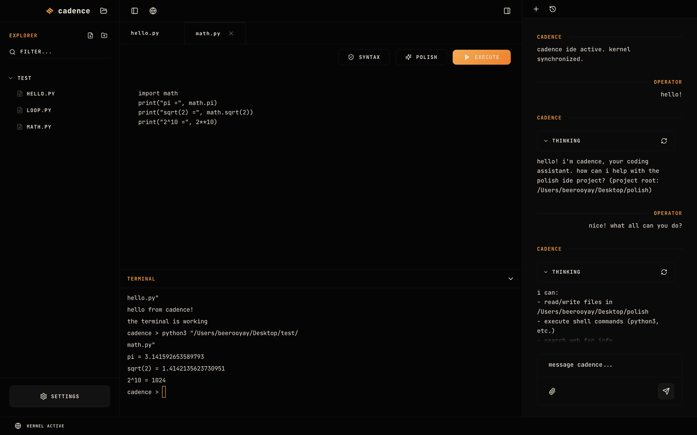
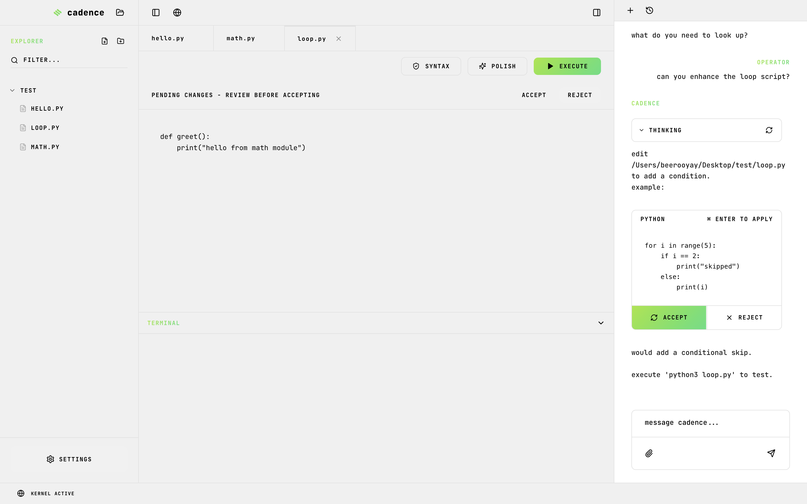
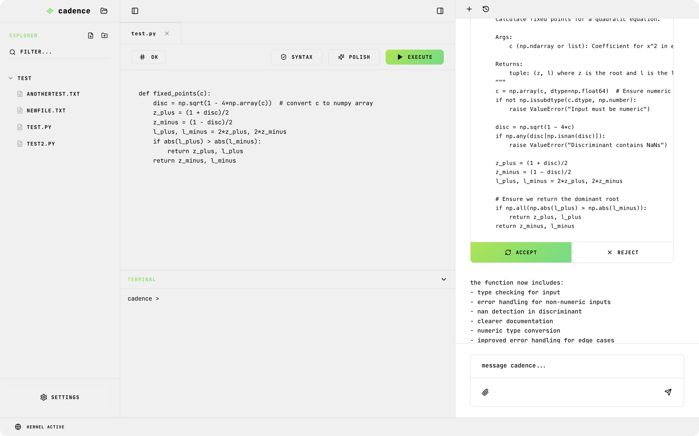
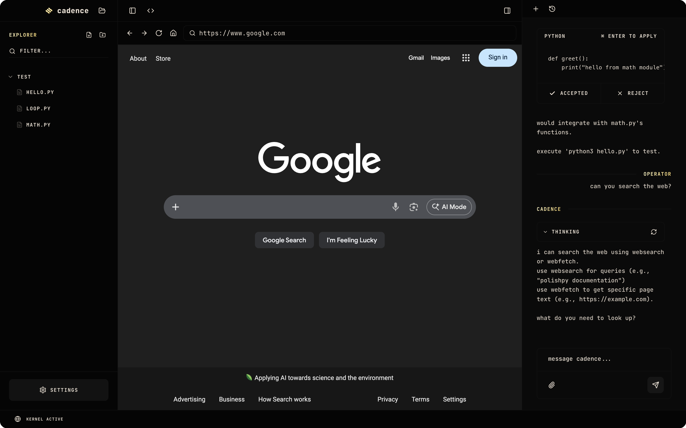

# cadence

a local-first ide with ai pair programming, built for apple silicon.

---

## what is cadence?

cadence is a lightweight code editor built from scratch with react, electron, and mlx-optimized language models. runs entirely local - no cloud apis, no telemetry, no subscriptions.

trained on polishpy, a python code quality framework. cadence understands python deeply - syntax, style, structure, and intent.

---

## features

- **local llm** - qwen3-4b running on mlx (apple silicon optimized)
- **tool calling** - read files, write files, execute commands, list directories, web search, web fetch
- **conversation memory** - context persists across your session
- **code suggestions** - ai proposes edits with accept/reject workflow
- **terminal** - full pty terminal with live output
- **file explorer** - browse, create, edit, delete files
- **web browser** - embedded chromium with ai-accessible web tools
- **theming** - 6 accent colors, dark/light/dawn modes, model selection

---

<br/>



*working terminal with python execution, math output visible. ai chat panel with thinking indicators and tool capabilities.*

<br/>



*ai-powered code suggestions with diff preview. pending changes banner with accept/reject workflow. light theme.*

<br/>



*preferences panel with 6 accent colors, theme modes, and local model selection (qwen/llama). blue theme shown.*

<br/>



*embedded chromium browser at google.com. ai can search the web and fetch page content for research tasks.*

<br/>

---

## stack

- react 19 + typescript + vite
- electron 39
- tailwindcss 4
- xterm.js
- mlx-lm (apple silicon inference)
- flask (local model server)

---

## models

cadence uses two local models via mlx:

| model        | size | purpose                             |
|--------------|------|-------------------------------------|
| qwen3-4b     | 4bit | chat, code generation, tool calling |
| llama-3.2-3b | 4bit | fallback, lighter tasks             |

models load on demand and auto-unload after 5 minutes of inactivity.

---

## tools

the cadence model has access to:

```text
readfile   - read file contents
writefile  - write to files  
execute    - run shell commands
listdir    - list directory contents
```

---

## polishpy

polishpy is the code quality backbone of cadence. it enforces:

- black formatting
- ruff linting  
- mypy type checking
- import organization
- trailing whitespace removal

cadence was trained to understand and generate polishpy-compliant code.

---

## install

```bash
git clone https://github.com/beerooyay/cadence
cd cadence
npm install
pip install mlx-lm flask flask-cors
npm run electron-dev
```

---

## build

```bash
npm run dist-mac-arm
```

---

## requirements

- macos (apple silicon recommended)
- node 18+
- python 3.10+
- ~8gb ram for model inference

---

## license

mit

---

built by @ceeboozwah and @beerooyay
